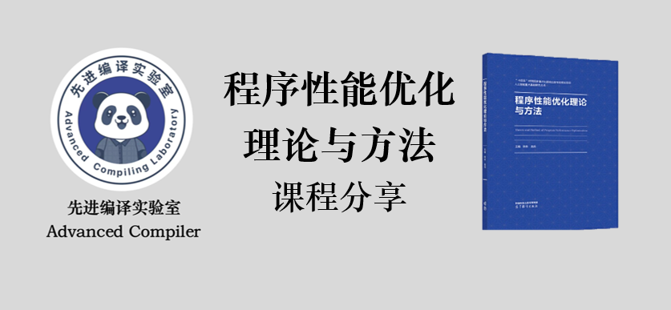
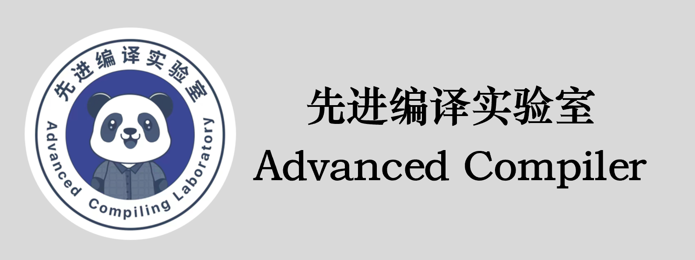

# 程序性能优化理论与方法 & 深度学习编译器设计
先进编译实验室编著的《程序性能优化理论与方法》（实操课程）以及《深度学习编译器设计》两本书籍所配套的文字课程、PPT课件以及配套code将陆续进行更新……同时也欢迎大家关注先进编译实验室的B站账号、知乎，添加微信小助手，加入交流群进行讨论学习，共同进步！！！

[bilibili个人主页](https://space.bilibili.com/1540261574/)
[知乎个人主页](https://www.zhihu.com/people/33-31-35-97)
[微信名片](img/weixin_logo.png)

先进编译实验室团队长期致力于高性能计算、编译技术、程序优化等方向的科研工作。先后承研国家重大专项、核高基专项、973、863、自然科学基金等相关课题，在高性能计算、并行程序设计与优化、国产自主可控等相关领域已经形成了若干领先成果，曾获国家科技进步一等奖、省部级科技进步一等奖等奖项。在国内外超算及程序优化的竞赛中，多次获PAC全国并行应用挑战赛优化金奖、银奖、铜奖，ASC世界大学生超级计算机竞赛一等奖、二等奖、卓越奖，CPC国产并行应用挑战赛银奖、铜奖，IPCC-ACM中国国际并行计算挑战赛二等奖等。

# 程序性能优化理论与方法

本书及课程从计算机体系结构、编译系统、操作系统、作业管理等多角度，对程序实现中的算法、数据结构、程序设计语言特性、资源占用及程序运行过程等多维度，全面探讨程序性能优化的理论和方法。
本书适用于具备一定程序设计基础并致力于程序性能优化的程序设计人员，也可以作为高等教育计算机程序设计的学习使用，还可作为从事性能优化专业技术人员的参考书。

## 章节目录
|||||
|---|---|---|---|
|章节名称|视频课程|实操课程|课件源码|
|1 程序性能优化的意义|[程序性能优化的意义(一)](https://www.bilibili.com/read/cv25998686/)     [bilibili](https://www.bilibili.com/video/BV1LL411B7uW)      [程序性能优化的意义(二)](https://www.bilibili.com/read/cv26044608/)     [bilibili](https://www.bilibili.com/video/BV15g4y1F7QQ)     ||[slide](slides/Chapter1.pptx)     [PDF](slides/Chapter1.pdf)     |
|2 程序性能的度量指标及优化流程|[程序性能的度量指标及优化流程](https://www.bilibili.com/read/cv26110227/)     [bilibili](https://www.bilibili.com/video/BV1vu411s7Xw)     ||[slide](slides/Chapter2.pptx)     [PDF](slides/Chapter2.pdf) [code](code/Chapter2/)|
|3 程序性能的分析和测量|[程序性能的分析和测量(一)](https://www.bilibili.com/read/cv26284969/)     [bilibili](https://www.bilibili.com/video/BV1ZV4y1U7wr)      [程序性能的分析和测量(二)](https://www.bilibili.com/read/cv26339611/)     [bilibili](https://www.bilibili.com/video/BV11k4y1p7Bw)      [程序性能的分析和测量(三)](https://www.bilibili.com/read/cv26440606/)     [bilibili](https://www.bilibili.com/video/BV1Wm4y1v7yZ)     ||[slide](slides/Chapter3.pptx)     [PDF](slides/Chapter3.pdf) [code](code/Chapter3/)|
|4 系统配置优化|[系统配置优化(一)](https://www.bilibili.com/read/cv26465284/)     [bilibili](https://www.bilibili.com/video/BV1go4y1K72Y)      [系统配置优化(二)](https://www.bilibili.com/read/cv26465434/)     [bilibili](https://www.bilibili.com/video/BV12o4y1P7kW)      ||[slide](slides/Chapter4.pptx)     [PDF](slides/Chapter4.pdf) [code](code/Chapter4/)|
|5 编译与运行优化|[编译与运行优化(一)](https://www.bilibili.com/read/cv26593897/)     [bilibili](https://www.bilibili.com/video/BV1KN4y1L7XT)      [编译与运行优化(二)](https://www.bilibili.com/read/cv26902172/)     [bilibili](https://www.bilibili.com/video/BV1KN4y1L7XT)      [编译与运行优化(三)](https://www.bilibili.com/read/cv26728595/)     [bilibili](https://www.bilibili.com/video/BV1KN4y1L7XT)      |[编译器前端](https://www.bilibili.com/read/cv33246459/)     [bilibili](https://www.bilibili.com/video/BV1NC411Y7A8) [编译器中端](https://www.bilibili.com/read/cv33260788/)     [bilibili](https://www.bilibili.com/video/BV1Xr421H7t3) [编译器后端](https://www.bilibili.com/read/cv33311872/)     [bilibili](https://www.bilibili.com/video/BV1gi421d7Hc) [编译选项](https://www.bilibili.com/read/cv33367074/)     [bilibili](https://www.bilibili.com/video/BV1Nr421n7Pd) [循环展开](https://www.bilibili.com/read/cv33543228/)     [bilibili](https://www.bilibili.com/video/BV13f421f7ip) [循环分布](https://www.bilibili.com/read/cv33612582/)     [bilibili](https://www.bilibili.com/video/BV1pj421d793)[知乎](https://zhuanlan.zhihu.com/p/690497025) [循环剥离](https://www.bilibili.com/read/cv33666036/)     [bilibili](https://www.bilibili.com/video/BV1AD421W7A1)[知乎](https://zhuanlan.zhihu.com/p/691358792) [过程间优化](https://www.bilibili.com/read/cv33477201/)     [bilibili](https://www.bilibili.com/video/BV15m411d7gH) [循环级向量化](https://www.bilibili.com/read/cv33760861/)     [bilibili](https://www.bilibili.com/video/BV19M4m1X7PU)[知乎](https://zhuanlan.zhihu.com/p/692201250) [基本块级向量化](https://www.bilibili.com/read/cv33867227/)     [bilibili](https://www.bilibili.com/video/BV1wp421y7k2)[知乎](https://zhuanlan.zhihu.com/p/693050648) [数据预取优化](https://www.bilibili.com/read/cv33889311/)     [bilibili](https://www.bilibili.com/video/BV1Dz421k72n)[知乎](https://zhuanlan.zhihu.com/p/693262484) [浮点优化](https://www.bilibili.com/read/cv34001479/)     [bilibili](https://www.bilibili.com/video/BV1BZ421e7t6) [反馈优化](https://www.bilibili.com/read/cv34126648/)     [bilibili](https://www.bilibili.com/video/BV1xx421S74X)[知乎](https://zhuanlan.zhihu.com/p/694742133) [链接时优化](https://www.bilibili.com/read/cv34218862/)     [bilibili](https://www.bilibili.com/video/BV1ZD421p7Gy)[知乎](https://zhuanlan.zhihu.com/p/695380833) [编译指示](https://www.bilibili.com/read/cv34219036/)     [bilibili](https://www.bilibili.com/video/BV1jZ421v791)[知乎](https://zhuanlan.zhihu.com/p/695382596) [数学库优化](https://www.bilibili.com/read/cv34325212/)     [bilibili](https://www.bilibili.com/video/BV12D421p79o)[知乎](https://zhuanlan.zhihu.com/p/695468331) [运行时优化](https://www.bilibili.com/read/cv34372946/)     [bilibili](https://www.bilibili.com/video/BV1ax4y167hV)[知乎](https://zhuanlan.zhihu.com/p/696635381)|[slide](slides/Chapter5.pptx)     [PDF](slides/Chapter5.pdf) [code](code/Chapter5/)|
|6 程序编写优化|[程序编写优化(一)](https://www.bilibili.com/read/cv26728808/)     [bilibili](https://www.bilibili.com/video/BV1gX4y1q7Ms)      [程序编写优化(二)](https://www.bilibili.com/read/cv26902172/)     [bilibili](https://www.bilibili.com/video/BV1Aj411S7kJ)      [程序编写优化(三)](https://www.bilibili.com/read/cv26937568/)     [bilibili](https://www.bilibili.com/video/BV1sg4y1N763)      [程序编写优化(四)](https://www.bilibili.com/read/cv27020337/)     [bilibili](https://www.bilibili.com/video/BV1rh411A79q)      [程序编写优化(五)](https://www.bilibili.com/read/cv27090785/)     [bilibili](https://www.bilibili.com/video/BV1mz4y1E7rb)      |[算法优化](https://www.bilibili.com/read/cv34416011/)     [bilibili](https://www.bilibili.com/video/BV1C142197zL)[知乎](https://zhuanlan.zhihu.com/p/697039107) [典型数据结构的性能分析](https://www.bilibili.com/read/cv34506282/)     [bilibili](https://www.bilibili.com/video/BV1ew4m127sJ)[知乎](https://zhuanlan.zhihu.com/p/697747139) [选择合适的数据类型](https://www.bilibili.com/read/cv34673418/)     [bilibili](https://www.bilibili.com/video/BV11t421c7N1)[知乎](https://zhuanlan.zhihu.com/p/698185460) [选择合适的数据结构](https://www.bilibili.com/read/cv34704402/)     [bilibili](https://www.bilibili.com/video/BV1vi421C7mB)[知乎](https://zhuanlan.zhihu.com/p/699074220) [别名消除](https://www.bilibili.com/read/cv34838624/)     [bilibili](https://www.bilibili.com/video/BV1tx4y1B75k)[知乎](https://zhuanlan.zhihu.com/p/700160135) [常数传播](https://www.bilibili.com/read/cv34933167/)     [bilibili](https://www.bilibili.com/video/BV1Cw4m1C7t3)[知乎](https://zhuanlan.zhihu.com/p/700774860) [传参优化](https://www.bilibili.com/read/cv35032486/)     [bilibili](https://www.bilibili.com/video/BV1NM4m1o7oH)[知乎](https://zhuanlan.zhihu.com/p/701450224) [内联优化](https://www.bilibili.com/read/cv35096886/)     [bilibili](https://www.bilibili.com/video/BV1CC411j7Zz) [过程克隆](https://www.bilibili.com/read/cv37323940/)     [bilibili](https://www.bilibili.com/video/BV17y411Y7Wo)[知乎](https://zhuanlan.zhihu.com/p/715444386) [全局变量优化](https://www.bilibili.com/read/cv37380397/)     [bilibili](https://www.bilibili.com/video/BV1vf421m7RY) [循环展开和压紧](https://www.bilibili.com/read/cv37729212/)     [bilibili](https://www.bilibili.com/video/BV1mx4y1H7ch) [循环不变量外提]()     [bilibili](https://www.bilibili.com/video/BV1nw4m1D7np/) [循环合并]()     [bilibili](https://www.bilibili.com/video/BV1k7421f77W/) [循环分段]()     [bilibili](https://www.bilibili.com/video/BV18z421Y7eR/) [循环分块]()     [bilibili](https://www.bilibili.com/video/BV1sJ4m137o2/) [循环交换]()     [bilibili](https://www.bilibili.com/video/BV1zx4y1n7fe/) [循环分裂]()     [bilibili](https://www.bilibili.com/video/BV1Et421N7E5/) [循环倾斜]()     [bilibili](https://www.bilibili.com/video/BV1Et421N7E5/) [循环分布]()     [bilibili](https://www.bilibili.com/video/BV16S411K7Zv/) [删除冗余语句]()     [bilibili](https://www.bilibili.com/video/BV1Bx4y1J7Uq/) [代数变换]()     [bilibili](https://www.bilibili.com/video/BV1G7421d7FB/) [公共子表达式优化]()     [bilibili](https://www.bilibili.com/video/BV1Nr421w7DW/) [合并判断条件]()     [bilibili](https://www.bilibili.com/video/BV1n4421Q7H8/) [生成选择指令]()     [bilibili](https://www.bilibili.com/video/BV1px4y1J7mR/) [分支语句优化之运用条件编译]()     [bilibili](https://www.bilibili.com/video/BV18Z421T7Tx/) [分支语句优化之移除分支语句]()     [bilibili](https://www.bilibili.com/video/BV1Bb421E7yE/)|[slide](slides/Chapter6.pptx)     [PDF](slides/Chapter6.pdf) [code](code/Chapter6/)|
|7 单核优化|[指令级并行(一)](https://www.bilibili.com/read/cv27182155/)     [bilibili](https://www.bilibili.com/video/BV1iV4y1h7wm)      [指令级并行(二)](https://www.bilibili.com/read/cv27239182/)     [bilibili](https://www.bilibili.com/video/BV1ym4y1E783)      [数据级并行(一)](https://www.bilibili.com/read/cv27244340/)     [bilibili](https://www.bilibili.com/video/BV1M94y1q7B4)      [数据级并行(二)](https://www.bilibili.com/read/cv27319972/)     [bilibili](https://www.bilibili.com/video/BV1Wj411R74A)      [数据级并行(三)](https://www.bilibili.com/read/cv27410580/)     [bilibili](https://www.bilibili.com/video/BV1Kk4y1G77z)     |[指令流水]()     [bilibili](https://www.bilibili.com/video/BV1dx4y147fD/) [超长指令字]()     [bilibili](https://www.bilibili.com/video/BV1Nf421z7Yy/) [函数的向量化]()     [bilibili](https://www.bilibili.com/video/BV1Uw4m1e7PE/) [基本块的向量化]()     [bilibili](https://www.bilibili.com/video/BV1A4421X7ov/) [循环的向量化]()     [bilibili](https://www.bilibili.com/video/BV1gZ421M7UP/) [分支向量化]()     [bilibili](https://www.bilibili.com/video/BV1ES421R7BC/) [归约向量化]()     [bilibili](https://www.bilibili.com/video/BV1Q4421U7UR/) [不对齐访存]()     [bilibili](https://www.bilibili.com/video/BV1cZ421u7oX/) [不连续访存]()     [bilibili](https://www.bilibili.com/video/BV1yS411c7nC/) [向量重用]()     [bilibili](https://www.bilibili.com/video/BV1Pw4m1Y7nH/) [向量运算融合]()     [bilibili](https://www.bilibili.com/video/BV1gy411i7cL/) [循环完全展开]()     [bilibili](https://www.bilibili.com/video/BV12H4y1w7cK/)|[slide](slides/Chapter7.pptx)     [PDF](slides/Chapter7.pdf) [code](code/Chapter7/)|
|8 访存优化|[访存优化(一)](https://www.bilibili.com/read/cv27540566/)     [bilibili](https://www.bilibili.com/video/BV1yz4y1s7qp)      [访存优化(二)](https://www.bilibili.com/read/cv27540566/)     [bilibili](https://www.bilibili.com/video/BV1fM4y1H7Ba)      [访存优化(三)](https://www.bilibili.com/read/cv27610451/)     [bilibili](https://www.bilibili.com/video/BV18m4y1W7fH)      [访存优化(四)](https://www.bilibili.com/read/cv27666011/)     [bilibili](https://www.bilibili.com/video/BV1Np4y1776Z)      [访存优化(五)](https://www.bilibili.com/read/cv27759411/)     [bilibili](https://www.bilibili.com/video/BV1gw411D7Bw)      [访存优化(六)](https://www.bilibili.com/read/cv27917259/)     [bilibili](https://www.bilibili.com/video/BV1cp4y1j7ga)      |[寄存器分配]()     [bilibili](https://www.bilibili.com/video/BV1kr421M7mc/) [寄存器重用]()     [bilibili](https://www.bilibili.com/video/BV1p142187Vu/) [缓存分块]()     [bilibili](https://www.bilibili.com/video/BV1o4421Z7Ld/) [减少伪共享]()     [bilibili](https://www.bilibili.com/video/BV1cZ421K7fz/) [数据预取]()     [bilibili](https://www.bilibili.com/video/BV1Jb421J7Fx/) [减少内存读写]()     [bilibili](https://www.bilibili.com/video/BV1amW8edE7Q/) [数据对齐]()     [bilibili](https://www.bilibili.com/video/BV1KCste1EQN/) [多线程操作]()     [bilibili](https://www.bilibili.com/video/BV1TksteLErP/) [数组重组]()     [bilibili](https://www.bilibili.com/video/BV1TksteLErM/) [数组转置]()     [bilibili](https://www.bilibili.com/video/BV18BHaeXECN/) [结构属性域调整]()     [bilibili](https://www.bilibili.com/video/BV1hqHaeWETX/) [结构体拆分]()     [bilibili](https://www.bilibili.com/video/BV18qHaeWEkd/) [结构体数组转换]()     [bilibili](https://www.bilibili.com/video/BV1wG4henEyc/)|[slide](slides/Chapter8.pptx)     [PDF](slides/Chapter8.pdf) [code](code/Chapter8/)|
|9 OpenMP程序优化|[OpenMP编程简介](https://www.bilibili.com/read/cv27917453/)     [bilibili](https://www.bilibili.com/video/BV1Zw411U7a8)      [并行区重构](https://www.bilibili.com/read/cv28098570/)     [bilibili](https://www.bilibili.com/video/BV1eu411A79T)      [向量化指导命令](https://www.bilibili.com/read/cv28275663/)     [bilibili](https://www.bilibili.com/video/BV12h4y1Y7vH)      [避免伪共享](https://www.bilibili.com/read/cv28352985/)     [bilibili](https://www.bilibili.com/video/BV1Gw411i7rS)      [负载均衡优化](https://www.bilibili.com/read/cv28353034/)     [bilibili](https://www.bilibili.com/video/BV1XN4y1o7NQ)      [避免隐式同步](https://www.bilibili.com/read/cv28464268/)     [bilibili](https://www.bilibili.com/video/BV19u4y1x7CS)      [流水并行优化](https://www.bilibili.com/read/cv28623151/)     [bilibili](https://www.bilibili.com/video/BV1LB4y1Z74v)      |[OpenMP程序编写]()     [bilibili](https://www.bilibili.com/video/BV19ntJeMEpD/) [OpenMP版矩阵乘]()     [bilibili](https://www.bilibili.com/video/BV1hstJeeEpc/) [并行区扩张]()     [bilibili](https://www.bilibili.com/video/BV1its8eYEQh/) [并行区合并]()     [bilibili](https://www.bilibili.com/video/BV1qts8eYEiH/) [数据填充避免伪共享]()     [bilibili](https://www.bilibili.com/video/BV1Z4s8eAEp9/) [循环向量化]()     [bilibili](https://www.bilibili.com/video/BV1hjxWe6EDy/) [循环嵌套合并调度]()     [bilibili](https://www.bilibili.com/video/BV13jxWe6EAP/) [线程调度配置策略]()     [bilibili](https://www.bilibili.com/video/BV1bh2tYJEq3/) [串并行切换]()     [bilibili](https://www.bilibili.com/video/BV1ub2tYDEXm/) [线程数设置优化]()     [bilibili](https://www.bilibili.com/video/BV1qM2ZY2EwV/) [分析隐式同步]()     [bilibili](https://www.bilibili.com/video/BV1K9yGYaEAs/) [消除隐式同步]()     [bilibili](https://www.bilibili.com/video/BV1N9yGYhEea/)|[slide](slides/Chapter9.pptx)     [PDF](slides/Chapter9.pdf) [code](code/Chapter9/)|
|10 CUDA程序优化|[CUDA程序优化(一)](https://www.bilibili.com/read/cv28626902/)     [bilibili](https://www.bilibili.com/video/BV1pB4y1f7Md)      [CUDA程序优化(二)](https://www.bilibili.com/read/cv28755607/)     [bilibili](https://www.bilibili.com/video/BV1C94y187iq)      [CUDA程序优化(三)](https://www.bilibili.com/read/cv28755625/)     [bilibili](https://www.bilibili.com/video/BV1Kw411z7Wd)      [CUDA程序优化(四)](https://www.bilibili.com/read/cv28815789/)     [bilibili](https://www.bilibili.com/video/BV1G84y1R7Ak)      ||[slide](slides/Chapter10.pptx)     [PDF](slides/Chapter10.pdf) [code](code/Chapter10/)|
|11 MPI程序优化|[MPI程序简介(一)](https://www.bilibili.com/read/cv29026871/)     [bilibili](https://www.bilibili.com/video/BV1cj411a7Sb)      [MPI程序简介(二)](https://www.bilibili.com/read/cv29589746/)     [bilibili](https://www.bilibili.com/video/BV1ra4y1m7JP)      [数据划分优化](https://www.bilibili.com/read/cv30127910/)     [bilibili](https://www.bilibili.com/video/BV1Lc411b7Fw)      ||[slide](slides/Chapter12.pptx)     [PDF](slides/Chapter12.pdf) [code](code/Chapter11/)|
|12 多层次并行程序优化|||[code](code/Chapter12/)|
||||
## 附录
### LLVM编译器入门
||||
|---|---|---|
|章节名称|视频课程|PPT|
|1 LLVM整体设计|[bilibili](https://www.bilibili.com/video/BV18j411B7TF)|[知乎](https://zhuanlan.zhihu.com/p/689182997)|
|2 Clang前端|[bilibili](https://www.bilibili.com/video/BV11j411B7XZ)|[知乎](https://zhuanlan.zhihu.com/p/689603871)|
|3 IR优化|[bilibili](https://www.bilibili.com/video/BV1fX4y1x79Y)||
|4 代码生成（上）|[bilibili](https://www.bilibili.com/video/BV1tN411B71r)||
|5 代码生成（下）|[bilibili](https://www.bilibili.com/video/BV1YG411o7AQ)||
### 循环优化专题
||||
|---|---|---|
|章节名称|视频课程|课件文章|
|1 循环展开和压紧|[bilibili](https://www.bilibili.com/video/BV1HB4y1x7zv)|[slide](slides/1循环展开.pptx)     [PDF](slides/1循环展开.pdf)[知乎](https://zhuanlan.zhihu.com/p/720113750)|
|2 循环合并|[bilibili](https://www.bilibili.com/video/BV1CD4y1B7H2)|[slide](slides/2循环合并.pptx)     [PDF](slides/2循环合并.pdf)[知乎](https://zhuanlan.zhihu.com/p/720117194)|
|3 循环分布|[bilibili](https://www.bilibili.com/video/BV1Z8411t7dC)|[slide](slides/3循环分布.pptx)     [PDF](slides/3循环分布.pdf)[知乎](https://zhuanlan.zhihu.com/p/568326883)|
|4 循环交换|[bilibili](https://www.bilibili.com/video/BV13d4y1C7ca)|[slide](slides/4循环交换.pptx)     [PDF](slides/4循环交换.pdf)[知乎](https://zhuanlan.zhihu.com/p/603088713)|
|5 循环不变量外提|[bilibili](https://www.bilibili.com/video/BV1Ud4y1b7Zc)|[slide](slides/5循环不变量外提.pptx)     [PDF](slides/5循环不变量外提.pdf)[知乎](https://zhuanlan.zhihu.com/p/720156712)|
|6 循环分段|[bilibili](https://www.bilibili.com/video/BV1Zs4y1s7zn)|[slide](slides/6循环分段.pptx)     [PDF](slides/6循环分段.pdf)[知乎](https://zhuanlan.zhihu.com/p/603106704)|
|7 循环分块|[bilibili](https://www.bilibili.com/video/BV1gv4y1Y7ed)|[slide](slides/7循环分块.pptx)     [PDF](slides/7循环分块.pdf)[知乎](https://zhuanlan.zhihu.com/p/609700144)|
|8 循环分裂|[bilibili](https://www.bilibili.com/video/BV1mb411f7wK)|[slide](slides/8循环分裂.pptx)     [PDF](slides/8循环分裂.pdf)[知乎](https://zhuanlan.zhihu.com/p/612902532)|
|9 循环倾斜|[bilibili](https://www.bilibili.com/video/BV1uV4y1f7cJ)|[slide](slides/9循环倾斜.pptx)     [PDF](slides/9循环倾斜.pdf)[知乎](https://zhuanlan.zhihu.com/p/622604808)|
### 其他
||||
|---|---|---|
|章节名称|视频课程|课件文章|
|HIP代码自动生成工具C2HIPC|[bilibili](https://www.bilibili.com/video/BV1Jg411Q7z6/)||

# 深度学习编译器设计
深度学习编译是一个博大精深且正在快速发展的领域，下面内容旨在分享先进编译实验室团队在学习深度学习编译领域过程中的对顶会论文、主流编译器等的学习心得。

## 分享目录
||||
|---|---|---|
|内容板块|分享视频|课件文章|
|1 深度学习概述|[深度学习的产生与发展](https://www.bilibili.com/video/BV1AM411P7JG/) [深度神经网络的结构](https://www.bilibili.com/video/BV1bD4y1G7oV/) [神经网络的运行机制](https://www.bilibili.com/video/BV1xs4y1b7nt/) [CNN-卷积神经网络（一）](https://www.bilibili.com/video/BV1iL411o7iz/) [CNN-卷积神经网络（二）](https://www.bilibili.com/video/BV1bL411o74W/)|[深度学习概述PDF](slides/2-1深度学习概述.pdf)[深度学习的产生与发展 知乎](https://zhuanlan.zhihu.com/p/605627284)[深度神经网络的结构 知乎](https://zhuanlan.zhihu.com/p/608212097)[神经网络的运行机制 知乎](https://zhuanlan.zhihu.com/p/608221436)[CNN-卷积神经网络 知乎](https://zhuanlan.zhihu.com/p/613894668)|
|2 深度学习编译基础|[深度学习框架发展（一）](https://www.bilibili.com/video/BV1iD4y117td) [深度学习框架发展（二）](https://www.bilibili.com/video/BV1dt4y1F7Cn) [深度学习框架发展（三）](https://www.bilibili.com/video/BV1Qe4y1z78o) [深度学习硬件平台](https://www.bilibili.com/video/BV1JY411Q72M) [深度学习编译发展概述](https://www.bilibili.com/video/BV1kS4y1t7JH) [深度学习编译系统概述](https://www.bilibili.com/video/BV1kS4y1t7JH) [深度学习自动微分](https://www.bilibili.com/video/BV1fs4y197km) |[深度学习框架发展PDF](slides/2-3深度学习框架发展3.pdf)[slides](slides/2-3深度学习框架发展3.pdf)[知乎](https://zhuanlan.zhihu.com/p/573649638) [深度学习硬件平台PDF](slides/2-4深度学习硬件平台.pdf)[slides](slides/2-4深度学习硬件平台.pptx)[知乎](https://zhuanlan.zhihu.com/p/601837693) [深度学习编译发展概述 知乎](https://zhuanlan.zhihu.com/p/573632566) [深度学习编译系统概述PDF](slides/2-6深度学习编译系统.pdf)[slides](slides/2-6深度学习编译系统.pptx)[知乎](https://zhuanlan.zhihu.com/p/573626535) [深度学习自动微分PDF](slides/2-7自动微分.pdf)[slides](slides/2-7自动微分.pptx)[知乎](https://zhuanlan.zhihu.com/p/624451377) |
|3 深度学习编译基础架构MLIR|[深度学习编译基础架构MLIR](https://www.bilibili.com/video/BV1Hd4y1U7mb) [论文分享：基于MLIR的GPU代码生成](https://www.bilibili.com/video/BV1ga411N736) |[深度学习编译基础架构MLIR PDF](slides/3-1MLIR_PPT.pdf)[slides](slides/3-1MLIR_PPT.pptx)[知乎](https://zhuanlan.zhihu.com/p/651886385) |
|4 深度学习编译器TVM|[TVM概述](https://www.bilibili.com/video/BV14N4y1c7zq) [TVM编译流程与中间表示分析（一）](https://www.bilibili.com/video/BV1v3411U7fM) [TVM编译流程与中间表示分析（二）](https://www.bilibili.com/video/BV1624y1v7wx) [TVM自动调度算法AutoTVM](https://www.bilibili.com/video/BV1114y1e7FK) [TVM自动调优工具Ansor](https://www.bilibili.com/video/BV1m14y1Y7LN) [Ansor优化算子代码解读（一）](https://www.bilibili.com/video/BV1ih4y127fX) [Ansor优化算子代码解读（二）](https://www.bilibili.com/video/BV1C44y1c7WL) [Ansor优化算子代码解读（三）](https://www.bilibili.com/video/BV1e94y167Qy) [Ansor优化算子代码解读（四）](https://www.bilibili.com/video/BV1C8411X7BS) [TVM量化框架（一）](https://www.bilibili.com/video/BV1ph4y1U7Dy) [TVM量化框架（二）](https://www.bilibili.com/video/BV1aN4y1R7MY) [TVM量化框架（三）](https://www.bilibili.com/video/BV1ur4y197zj) [TVM量化框架（四）](https://www.bilibili.com/video/BV18w411S7Mh)|[TVM编译流程与中间表示分析PDF](slides/4-2TVM%20IR流程.pdf)[slides](slides/4-2TVM%20IR流程.pptx)[知乎](https://zhuanlan.zhihu.com/p/596526031) |
|5 OpenAI Triton编译器|[Triton概述](https://www.bilibili.com/video/BV1Kr421M7rt) [Triton安装](https://www.bilibili.com/video/BV1b9W8eQEW3) [Triton程序编写](https://www.bilibili.com/video/BV154421S7TE) [Triton源码结构](https://www.bilibili.com/video/BV1SHxWeTEMe/) [Triton调试方法及工具（上）](https://www.bilibili.com/video/BV1aY2CYAEhy/) [Triton调试方法及工具（下）]() [Triton编译流程](https://www.bilibili.com/video/BV1Di2CYcEba/) |[Triton概述slides](slides/5-1Triton概述.pptx)[知乎](https://zhuanlan.zhihu.com/p/750277836) [Triton安装PDF](slides/5-2Triton安装方式.pdf)[slides](slides/5-2Triton安装方式.pptx)[知乎](https://zhuanlan.zhihu.com/p/751581417) [Triton程序编写PDF](slides/5-4Triton程序编写.pdf)[slides](slides/5-4Triton程序编写.pptx) [Triton源码结构PDF](slides/5-3Triton源码结构.pdf)[slides](slides/5-3Triton源码结构.pptx)[知乎](https://zhuanlan.zhihu.com/p/2764427002) [Triton调试方法及工具PDF](slides/5-5Triton调试.pdf)[slides](slides/5-5Triton调试.pptx)[知乎](https://zhuanlan.zhihu.com/p/2440320343) [Triton编译流程PDF](slides/5-6Triton编译流程.pdf)[slides](slides/5-6Triton编译流程.pptx)[知乎](https://zhuanlan.zhihu.com/p/2768070031) |
|6 深度学习编译优化 |[论文分享：图算融合Apollo](https://www.bilibili.com/video/BV1Do4y1L7Xd) [论文分享：计算密集型算子融合Chimera](https://www.bilibili.com/video/BV1Y6421G7kL) [论文分享：机器学习访存密集计算编译优化框架Astitch](https://www.bilibili.com/video/BV1Ev4y1Q7L4) [论文分享：算子调度优化Rammer](https://www.bilibili.com/video/BV1LM411u7nE) [论文分享：计算图访存调度优化Welder](https://www.bilibili.com/video/BV1Tu4y1y7hN) [论文分享：动态控制流编译优化Cocktailer](https://www.bilibili.com/video/BV1Kh4y1P7Rg) [论文分享：动态神经网络编译优化BrainStorm](https://www.bilibili.com/video/BV1FC4y1R7pu) [论文分享：动态shape深度学习算子自动调优DietCode](https://www.bilibili.com/video/BV1RP4y167P4) [论文分享：动态shape深度学习编译器DISC](https://www.bilibili.com/video/BV16R4y1U7J5) [论文分享：深度学习编译接口FreeTensor](https://www.bilibili.com/video/BV1uV4y1M7dQ) |[论文分享：图算融合Apollo PDF](slides/6-1Apollo.pdf)[slides](slides/6-1Apollo.pptx)[知乎](https://zhuanlan.zhihu.com/p/622494022) [论文分享：机器学习访存密集计算编译优化框架Astitch PDF](slides/6-3AStitch.pdf)[slides](slides/6-3AStitch.pptx)[知乎](https://zhuanlan.zhihu.com/p/593171346) [论文分享：算子调度优化Rammer PDF](slides/6-4Rammer.pptx)[slides](slides/6-4Rammer.pptx)[知乎](https://zhuanlan.zhihu.com/p/616050345) [论文分享：动态控制流编译优化Cocktailer PDF](slides/6-6动态控制流优化.pdf)[slides](slides/6-6动态控制流优化.pptx) [论文分享：动态shape深度学习算子自动调优DietCode PDF](slides/6-8DietCode.pdf)[slides](slides/6-8DietCode.pptx)[知乎](https://zhuanlan.zhihu.com/p/601937783) [论文分享：动态shape深度学习编译器DISC PDF](slides/6-9动态模型编译.pdf)[slides](slides/6-9动态模型编译.pptx)[知乎](https://zhuanlan.zhihu.com/p/595830878) |
|7 自动并行|[并行划分概述](https://www.bilibili.com/video/BV1wo4y1L7WJ) [论文分享：自动并行Alpa](https://www.bilibili.com/video/BV11j41177TQ) [论文分享：自动并行AlpaServe](https://www.bilibili.com/video/BV1wc411m7ki) [论文分享：自动并行AvgPipe](https://www.bilibili.com/video/BV1rw41137QG) [论文分享：并行程序自动转换](https://www.bilibili.com/video/BV1sa4y1C7p7) [论文分享：高性能计算领域大语言模型HPC-Coder](https://www.bilibili.com/video/BV1e4421c7Gk) [论文分享：自动并行FlexFlow](https://www.bilibili.com/video/BV1wg411H78v) [论文分享：自动并行CoCoNet](https://www.bilibili.com/video/BV1Nv4y1j78t) [论文分享：新型注意力算法FlashAttention](https://www.bilibili.com/video/BV1zs4y1J7tb) [论文分享：数据并行通信优化MG-WFBP](https://www.bilibili.com/video/BV1hj411Z7SS) [论文分享：自动并行Merak](https://www.bilibili.com/video/BV1T94y1C7i4) |[并行划分概述PDF](slides/7-1自动并行-并行划分.pdf)[slides](slides/7-1自动并行-并行划分.pptx)[知乎](https://zhuanlan.zhihu.com/p/624687216) [论文分享：高性能计算领域大语言模型HPC-Coder PDF](slides/7-6HPC大模型.pdf)[slides](slides/7-6HPC大模型.pptx) [论文分享：自动并行CoCoNet PDF](slides/7-8overlapping.pdf)[slides](slides/7-8overlapping.pptx)[知乎](https://zhuanlan.zhihu.com/p/615806751) [论文分享：新型注意力算法FlashAttention PDF](slides/7-9FlashAttention.pdf)[slides](slides/7-9FlashAttention.pptx)[知乎](https://zhuanlan.zhihu.com/p/618533434) |
|8 深度学习模型压缩|[深度学习模型压缩概述](https://www.bilibili.com/video/BV1ht4y1P73i) [论文分享：无数据模型量化ZeroQ](https://www.bilibili.com/video/BV1614y1T7FS) [模型压缩方法：模型蒸馏](https://www.bilibili.com/video/BV1eb411971p) [模型压缩方法：剪枝](https://www.bilibili.com/video/BV1pg4y1J73p) [模型压缩方法：量化](https://www.bilibili.com/video/BV1bL411U747) |[论文分享：无数据模型量化ZeroQ 知乎](https://zhuanlan.zhihu.com/p/598849539) [模型压缩方法PDF](slides/8-3压缩方法.pdf)[slides](slides/8-3压缩方法.pptx)[知识蒸馏 知乎](https://zhuanlan.zhihu.com/p/608197552)[剪枝 知乎](https://zhuanlan.zhihu.com/p/609126518)[量化 知乎](https://zhuanlan.zhihu.com/p/619914824) |

